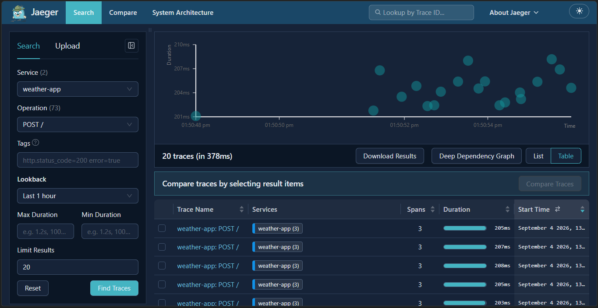
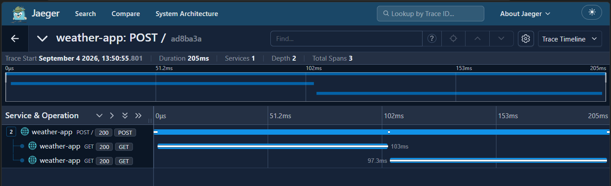
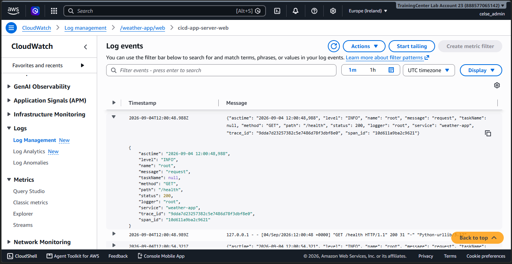
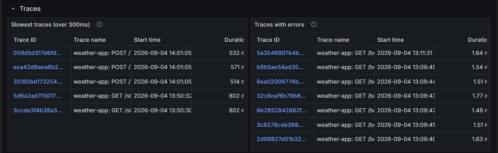
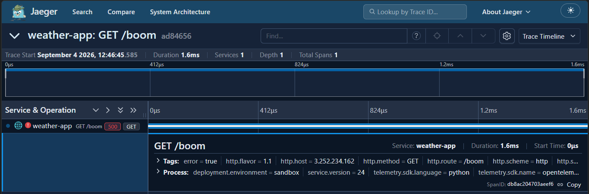
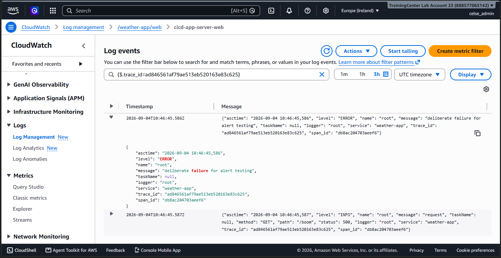

# Monitoring, Security & Tracing Lab

Observability, threat detection and distributed tracing for a containerised
Flask weather app running on AWS: Prometheus, Grafana, Alertmanager, Jaeger,
CloudWatch Logs, CloudTrail and GuardDuty, all provisioned with Terraform and
configured with Ansible.

The app itself is built and deployed by
[jenkins-cicd-lab](https://github.com/Smiley2507/jenkins-cicd-lab), which also
holds the OpenTelemetry instrumentation — instrumentation belongs with the code
it instruments. This repository holds the observability platform.

> **Branch note.** This branch adds distributed tracing on top of the
> observability work tagged `v2-simplified` on `main`. It is the submission for the Advanced Observability & Distributed Tracing project.

---

## Contents

- [What it does](#what-it-does)
- [Architecture](#architecture)
- [Tracing](#tracing)
- [Prerequisites](#prerequisites)
- [Deploy](#deploy)
- [Access](#access)
- [Evidence](#evidence)
- [Repository layout](#repository-layout)
- [Design decisions](#design-decisions)
- [Teardown](#teardown)

---

## What it does

| Layer | Tool | What it gives you |
|-------|------|-------------------|
| Metrics | Prometheus | Scrapes 7 targets every 15s, evaluates 4 alert rules |
| Dashboards | Grafana | Latency, requests/sec, error rate, host health |
| Notification | Alertmanager | Routes firing alerts to Discord |
| Logs | CloudWatch Logs | Containers via the Docker `awslogs` driver, Jenkins via the CloudWatch agent |
| Audit | CloudTrail | Multi-region trail into an encrypted, versioned S3 bucket with lifecycle rules |
| Threat detection | GuardDuty | Continuous analysis of CloudTrail, VPC flow and DNS logs |
| Tracing | Jaeger v2 | OTLP span ingest on 4318, UI on 16686, Badger storage with a 72h TTL |
### Scrape targets

Seven targets across five jobs.

| Job | Target | Exposes |
|-----|--------|---------|
| `prometheus` | itself | scrape durations, TSDB size, rule failures |
| `node` | all 3 hosts | CPU, memory, disk, load, network |
| `weather-app` | app server `/metrics` | request counts, durations, status codes |
| `jenkins` | Jenkins `/prometheus/` | build queue, executors, job durations |
| `jaeger` | Jaeger `:8888` | span ingest rate, storage writes, internal queue depth |

### Alert rules

Four rules in two groups. The two the project requires:

| Rule | Fires when | For |
|------|-----------|-----|
| HighErrorRate | 5xx above 5% of requests | 10m |
| HighLatency | p95 request duration above 300ms | 10m |

Both include a minimum request-rate clause so an idle server cannot alert on a
zero-divided-by-zero error rate. The threshold is 0.01 req/s, calibrated against
this deployment's actual idle traffic.

---

## Architecture

One new EC2 instance joins the existing VPC and scrapes the two hosts that were
already there.


Solid lines are metrics being **pulled**; dashed lines are logs being **pushed**.
The monitoring server scrapes the app server and the Jenkins server over the VPC
(9100 for node_exporter, 80 for the app, 8080 for Jenkins), and Alertmanager
pushes notifications out to Discord. Independently, all three hosts push logs to
CloudWatch Logs, CloudTrail delivers its own logs to an S3 bucket, and GuardDuty
continuously analyses both.

Nothing is pushed to Prometheus, which is why the security groups must let the
monitoring host reach those exporter ports inside the VPC. It is also why a
target showing DOWN is more often a network rule than a broken exporter.

Prometheus and Grafana publish their own ports, restricted by security group to
the operator's IP. Prometheus has no authentication of its own, so access
control is at the network layer; Grafana keeps its own login.

---

## Tracing

Each request produces a trace: a Flask server span, plus a child span for any
outbound HTTP call. Spans are exported over OTLP to Jaeger on the monitoring
host.

Instrumentation lives in the application repository:

| File | Purpose |
|------|---------|
| `app/tracing.py` | OTel SDK setup, Flask and requests instrumentation, OTLP exporter |
| `app/logging_config.py` | JSON log formatter that attaches `trace_id` and `span_id` |

Tracing activates only when `OTEL_EXPORTER_OTLP_ENDPOINT` is set, so tests and
local runs are unaffected.

### Correlating an alert with a root cause

1. **Alert** arrives in Discord with the rule name, the value and links.
2. **Trace** — the link opens Jaeger filtered to this service and to spans
   tagged `error=true`. The Grafana dashboard's Traces row shows the same.
3. **Log** — copy the trace ID and filter CloudWatch:

```bash
aws logs filter-log-events --log-group-name /weather-app/web \
  --filter-pattern '"<trace-id>"' --profile sandbox-user --region eu-west-1
```

Metrics carry no trace ID: a metric is an aggregate, and a per-request label
would create one series per request. The alert supplies the time window; Jaeger
supplies the request; the trace ID supplies the logs.

## Prerequisites

- The CI/CD stack deployed and running — this stack discovers its VPC by tag
- Terraform ≥ 1.11, Ansible, AWS CLI with a `sandbox-user` profile in `eu-west-1`
- The CI/CD stack's key pair at `../jenkins-cicd-lab/terraform/cicd-key.pem`
- A Discord webhook URL for alert notifications

---

## Deploy

### 1. Infrastructure

```bash
cd terraform
cp terraform.tfvars.example terraform.tfvars
terraform init
terraform apply
```

Creates: the monitoring EC2 instance and its security group, an IAM instance
profile for CloudWatch, the CloudTrail bucket and trail, the GuardDuty detector,
and the CloudWatch log groups with 14-day retention.

The security group allows SSH, 3000 and 9090 from `local.admin_cidr`, which is
resolved from `checkip.amazonaws.com` at plan time. **Change networks and you
lock yourself out until you re-apply.**

**GuardDuty allows one detector per account per region.** If the account already
has one, import it before applying or `terraform apply` will fail:

```bash
aws guardduty list-detectors --profile sandbox-user --region eu-west-1
terraform import aws_guardduty_detector.main <detector-id>
```

### 2. Secrets

The Discord webhook URL contains a token that grants posting rights to the
channel, so it is treated as a credential — kept out of git, and out of
Ansible's run output.

```bash
cd ../ansible
mkdir -p group_vars/all
echo 'alertmanager_discord_webhook: "https://discord.com/api/webhooks/..."' \
  > group_vars/all/secrets.yml
```

`group_vars` files are named after **inventory groups**, not merged by filename.
A file called `group_vars/secrets.yml` loads only if a group named `secrets`
exists — otherwise Ansible ignores it silently and the `CHANGE-ME` placeholder
reaches the host. Making `all` a directory means every file inside it loads for
every host: `all/main.yml` holds committed defaults, `all/secrets.yml` (which is
gitignored) holds the webhook.

### 3. Configuration

```bash
ansible-playbook site.yml
```

Two plays: node_exporter on all hosts, then the monitoring stack on the new
host. Hosts come from the EC2 dynamic inventory and are grouped by their `Role`
tag, so no IP is ever written down.

The run ends by reporting how many scrape targets are UP — the single most
useful check in the whole playbook.

### 4. Verify

```bash
IP=$(cd ../terraform && terraform output -raw monitoring_public_ip)

curl -s "http://$IP:9090/-/ready"                                    # Prometheus OK
curl -s "http://$IP:9090/api/v1/query?query=sum(up)" | grep -o '"value".*'   # 7
curl -s -o /dev/null -w '%{http_code}\n' "http://$IP:3000/api/health"        # 200

aws logs tail /weather-app/web --since 10m --profile sandbox-user --region eu-west-1
aws logs tail /jenkins/system  --since 10m --profile sandbox-user --region eu-west-1
```

---

## Access

```bash
terraform output monitoring_url    # Grafana  :3000
terraform output prometheus_url    # Prometheus :9090
```

| URL | What | Auth |
|-----|------|------|
| `http://<ip>:3000/` | Grafana dashboards | Grafana login |
| `http://<ip>:9090/targets` | Scrape health — first place to look | none; security group |
| `http://<ip>:9090/alerts` | Alert rules and their state | none; security group |
| `http://<ip>:16686/` | Jaeger UI | none; security group |

Both ports are restricted to the operator's IP.

---

## Evidence

Screenshots proving the monitoring and tracing path works end to end, walked in
the order data actually flows: metrics and traces get collected, dashboards
render them, alert rules evaluate them and notify, that alert leads to a trace
and a log line, and everything is separately logged and audited.

### 1. Metrics are being collected


All seven targets UP across five jobs. This is the single best proof that the
scrape path works end to end — security groups, exporters, and the app's own
`/metrics` endpoint all have to be correct for this page to look like this.


A PromQL query graphing request rate by HTTP status. The visible 200, 400 and
404 series confirm that application metrics aren't just scraped but queryable.

### 2. Traces are being collected



Twenty traces for `weather-app`, found by service and operation rather than by
grepping logs. This is the same data Grafana's Traces row queries — proof that
spans are actually reaching Jaeger's OTLP receiver, not just configured to.



One request's full span tree: the Flask server span plus a child span for each
outbound call it made, three spans totalling 205ms. This is what a `HighLatency`
firing points investigators at — which span in the request was slow, not just
which request.



A routine `GET /health` request log in CloudWatch, already carrying `trace_id`
and `span_id` fields next to the usual message and status. Every request gets
this, successful or not, which is what makes the CloudWatch query in section 6
possible for any trace, not just a failing one.

### 3. Dashboards visualize them


The Application row: error rate, requests per second, requests by status, and
latency percentiles — the three signals the project requires, plus a count of
targets up. Loaded from JSON in this repo rather than saved in the Grafana UI,
so it survives a container rebuild.


The Hosts row: CPU, memory and root disk across all three machines from
node_exporter — infrastructure health alongside application health.


p50/p95/p99 latency. An average would hide the tail: ninety-nine fast requests
and one very slow one average out to something that looks fine while a real user
waited ten seconds. The alert fires on p95 above 300ms.



The dashboard's Traces row, backed by the Jaeger datasource: slowest traces over
300ms on the left, traces tagged `error=true` on the right. Both panels return
real trace IDs rather than "No data," so the Grafana-to-Jaeger wiring works, not
just parses.


Prometheus and Jaeger, both provisioned as datasources rather than added by
hand. Jaeger's is what lets the Traces row above query it, and what would let a
panel jump from a metric straight into a trace via trace-to-logs.

### 4. Alert rules evaluate them


All four rules loaded, including the one the project requires, `HighErrorRate`
(5xx above 5% of traffic, sustained 10 minutes).


A rule firing under an induced outage. `HighErrorRate` uses the same evaluation
mechanism with a different expression — a rule reaching FIRING here proves the
whole path, not just that the rules parse.

### 5. ...and notify Discord


The alert arriving in the `#alerts` Discord channel with its severity and
instance labels intact, and the matching RESOLVED notification once the service
recovered. Rule evaluated in Prometheus, grouped and routed by Alertmanager,
delivered to a human — and, with tracing in place, the message also links
straight into Jaeger. The next section is what that link opens.

### 6. ...into the trace and the log line behind it



The `GET /boom` request that triggered the alert above: a single 1.6ms span
tagged `error=true` and `http.status_code=500`, with its span ID visible for the
next step. This is the trace Discord's link opens — proof that the `error=true`
tag Grafana's "Traces with errors" panel filters on is actually set on a real
failing span, not a hypothetical one.



Filtering CloudWatch by that exact `trace_id` returns the log lines for the same
request — the error log and the request log — both carrying the identical
`trace_id` and `span_id` as the trace above. This is the last link in the chain:
the alert names a time window, Jaeger names the request, and this query names
the log line.

### 7. Logs


Log groups with an explicit 14-day retention policy declared in Terraform — not
auto-created by the Docker driver, which would keep (and bill for) the data
forever.


Real application request logs arriving in `/weather-app/web`.

### 8. Audit and threat detection


The multi-region trail, with log file validation enabled.


The trail's destination bucket: encrypted, versioned, public access blocked, and
a lifecycle policy moving objects to Infrequent Access at 30 days, Glacier IR at
90, and expiring them at 365.


GuardDuty enabled, with sample findings generated deliberately via
`aws guardduty create-sample-findings`. These are labelled `[SAMPLE]` — the
account was not actually attacked. They exist to exercise the detection and
display path end to end without waiting for a real incident.

---

## Repository layout

```
terraform/    monitoring host, IAM, CloudTrail + S3, GuardDuty, CloudWatch groups
ansible/      roles: docker, node_exporter, monitoring
monitoring/   docker-compose.yml, plus one directory per tool:
  prometheus/   prometheus.yml.j2, rules/alerts.yml
  alertmanager/ alertmanager.yml
  grafana/      provisioning/ (datasources, dashboards)
  jaeger/       config.yaml — OTLP ingest, Badger storage, 72h TTL
docs/         REPORT.md — an earlier, larger-scope design writeup (historical)
screenshots/  evidence
monitoring-lab-architecture.png   architecture diagram (see Architecture)
```

Everything under `monitoring/` is the source of truth; Ansible copies it to
`/opt/monitoring` on the host. Only two files are templated, because only two
depend on runtime facts:

- `prometheus/prometheus.yml.j2` — needs every host's private IP, from inventory
- `ansible/roles/monitoring/templates/env.j2` — image tags, credentials, public IP

Everything else is plain YAML, so the file you read in the repo is byte-for-byte
the file running on the host.

---

## Design decisions

**Scope kept to what the requirements call for.** An earlier version added an
nginx reverse proxy with basic auth, cAdvisor, nginx-exporter, nine alert rules
and twenty-one dashboard panels. That was more machinery than a single-file
Flask app needs, and complexity that cannot be explained is a liability rather
than an asset. It was cut back to the stated requirements.

**Network-layer access control, not basic auth.** Prometheus has no
authentication of its own, so the security group restricts port 9090 to the
operator's IP. The previous basic-auth proxy sent credentials in the clear over
plain HTTP to anyone who could already reach the port — a weak control layered
on a strong one. In production both ports would terminate TLS.

**`/metrics` restricted to the VPC.** Metrics leak endpoint names, traffic
volumes, error rates and version numbers, which is reconnaissance material. The
app's nginx allows the VPC CIDR so Prometheus can scrape it and denies the rest.
Side effect worth knowing: curling it *from the app server itself* returns 403,
because Docker's NAT rewrites host-local traffic to a bridge address outside the
allowed range. That is the rule working — test from the monitoring host.

**IAM instance profile, not access keys.** Both hosts assume a role for
CloudWatch access. No long-lived credentials exist anywhere in this repo or on
any instance.

**Compose is static; only `.env` is generated.** Docker Compose substitutes
`${VAR}` from a `.env` file beside it, so `docker-compose.yml` is plain YAML and
every deployment-specific value lives in one seven-line file. Templating the
compose file itself meant the version in the repo was never the version running.

**Directory bind mounts, not single files.** A single-file bind mount binds that
file's *inode*. Ansible writes a temp file and renames it into place, creating a
new inode — so the container keeps serving the old content and a reload re-reads
a file that no longer exists. Mounting the directory makes Docker resolve the
path on each open.

**File modes account for container UIDs.** Containers share the host's numeric
UID namespace but not its user names. Alertmanager runs as UID 65534, so a
config file at mode 0640 owned by `ec2-user` is unreadable to it and the
container crash-loops. Config files that containers read are mode 0644.

**Dashboards provisioned from JSON.** Saving a dashboard in the Grafana UI
creates drift that disappears the next time the container is recreated. The JSON
in this repo is authoritative.

**Targets generated from inventory.** Scrape addresses are rendered into
`prometheus.yml` from the EC2 dynamic inventory when Ansible runs, so no IP is
hand-written. Rebuild the infrastructure, run the playbook, and the addresses
are correct again.

**AMI pinned rather than resolved.** A `data "aws_ami"` lookup with
`most_recent = true` re-resolves on every plan, so the day AWS publishes a new
image Terraform wants to replace every instance. Pinning means a plan reflects
intentional changes.

**Jaeger v2, not v1.** v1 reached end-of-life in December 2025. v2 is built on
the OpenTelemetry Collector, so its configuration is one explicit YAML file
rather than a set of environment variables, and the same format would later
accept a metrics pipeline.

**Badger for span storage.** An embedded key-value store shipped in the Jaeger
image: traces survive a restart with no separate storage service. Elasticsearch
or Cassandra would be the choice at scale, and neither fits alongside Prometheus
and Grafana on a t3.small.

**Container UIDs decide host file ownership.** Images run as unprivileged,
image-specific UIDs — nginx 101, Alertmanager 65534, Jaeger 10001. Containers
share the host's numeric UID namespace but not its user names, so any host path
a container writes to is owned by that number.

**Metrics stayed on prometheus_flask_exporter.** Moving them to OpenTelemetry
would rename every series and invalidate the existing dashboards and alert
rules, which the brief asks to retain. Adopting OTel signal by signal —
tracing first, metrics later behind a Collector — is the normal migration path.

---

## Teardown

```bash
cd terraform
terraform destroy
```

The CloudTrail bucket has versioning enabled, so empty it first — otherwise the
destroy fails on a non-empty bucket:

```bash
aws s3 rm s3://$(terraform output -raw cloudtrail_bucket) --recursive
```

Verify afterwards that the GuardDuty detector, the trail, the bucket and the
CloudWatch log groups are all gone.