# Monitoring & Security Lab

Observability and threat detection for a containerised Flask weather app running
on AWS: Prometheus, Grafana, Alertmanager, CloudWatch Logs, CloudTrail and
GuardDuty, all provisioned with Terraform and configured with Ansible.

The app itself is built and deployed by
[jenkins-cicd-lab](https://github.com/Smiley2507/jenkins-cicd-lab). That project
answers *"can we ship it?"* — this one answers *"is it healthy, and would we know
if it wasn't?"*

---

## Contents

- [What it does](#what-it-does)
- [Architecture](#architecture)
- [Prerequisites](#prerequisites)
- [Deploy](#deploy)
- [Access](#access)
- [Evidence](#evidence) — screenshots proving each capability
- [Repository layout](#repository-layout)
- [Design decisions](#design-decisions)
- [Teardown](#teardown)

---

## What it does

| Layer | Tool | What it gives you |
|-------|------|-------------------|
| Metrics | Prometheus | Scrapes 9 targets every 15s, evaluates 9 alert rules |
| Dashboards | Grafana | Latency, requests/sec, error rate, host and container health |
| Notification | Alertmanager | Routes firing alerts to Discord |
| Logs | CloudWatch Logs | Containers via the Docker `awslogs` driver, Jenkins via the CloudWatch agent |
| Audit | CloudTrail | Multi-region trail into an encrypted, versioned S3 bucket with lifecycle rules |
| Threat detection | GuardDuty | Continuous analysis of CloudTrail, VPC flow and DNS logs |

### Scrape targets

| Job | Target | Exposes |
|-----|--------|---------|
| `prometheus` | itself | scrape durations, TSDB size, rule failures |
| `node` | all 3 hosts | CPU, memory, disk, load, network |
| `weather-app` | app server `/metrics` | request counts, durations, status codes |
| `cadvisor` | app + monitoring | per-container CPU and memory |
| `nginx` | app server `:9113` | active connections, requests/sec |
| `jenkins` | Jenkins `/prometheus/` | build queue, executors, job durations |

### Alert rules

Nine rules in three groups. The one the project requires is **HighErrorRate** —
5xx responses above 5% of traffic, sustained for 2 minutes.

| Group | Rules |
|-------|-------|
| weather-app | HighErrorRate, HighLatency, AppDown |
| hosts | TargetDown, HighCpuUsage, HighMemoryUsage, LowDiskSpace, HostRebooted |
| containers | ContainerRestarting |

---

## Architecture

One new EC2 instance joins the existing VPC and scrapes the two hosts that were
already there.

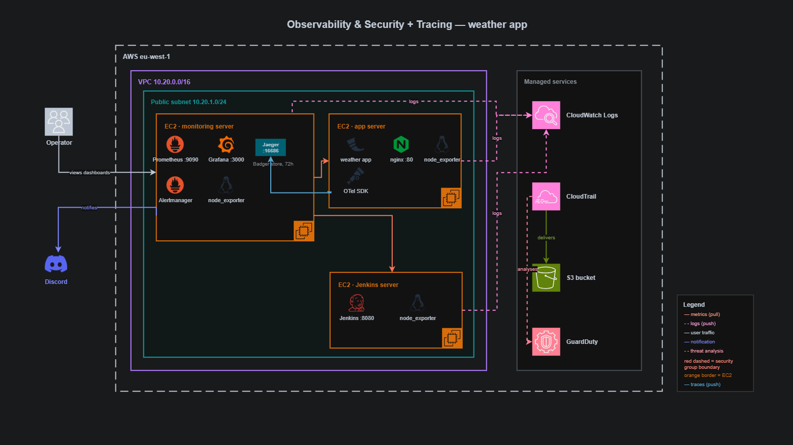

Solid lines are metrics being **pulled**; dashed lines are logs being **pushed**.
The monitoring server scrapes the app server and the Jenkins server over the VPC
(9100 / 8080 / 9113), and Alertmanager pushes notifications out to Discord.
Independently, all three hosts push logs to CloudWatch Logs, CloudTrail delivers
its own logs to an S3 bucket, and GuardDuty continuously analyses both. Nothing
is pushed to Prometheus, which is why the security groups must let the
monitoring host reach those three exporter ports inside the VPC.

Grafana and Prometheus are never exposed directly. nginx proxies both, adds HTTP
basic auth in front of Prometheus (which has no authentication of its own), and
only the operator's IP can reach either port.

---

## Prerequisites

- The CI/CD stack deployed and running — this stack discovers its VPC by tag
- Terraform ≥ 1.11, Ansible, AWS CLI with a `sandbox-user` profile in `eu-west-1`
- The CI/CD stack's key pair at `../jenkins-cicd-lab/terraform/cicd-key.pem`
- A Discord webhook URL for alert notifications

---

## Deploy

### 1. Infrastructure

```bash
cd terraform
cp terraform.tfvars.example terraform.tfvars   # set your admin CIDR
terraform init
terraform apply
```

Creates: the monitoring EC2 instance and its security group, an IAM instance
profile for CloudWatch, the CloudTrail bucket and trail, the GuardDuty detector,
and the CloudWatch log groups with 14-day retention.

**GuardDuty allows one detector per account per region.** If the account already
has one, import it before applying or `terraform apply` will fail:

```bash
aws guardduty list-detectors --profile sandbox-user --region eu-west-1
terraform import aws_guardduty_detector.main <detector-id>
```

### 2. Secrets

The Discord webhook URL contains a token that grants the ability to post to the
channel, so it is treated as a credential — kept out of git and out of Ansible's
log output.

```bash
cd ../ansible
mkdir -p group_vars/all
echo 'alertmanager_discord_webhook: "https://discord.com/api/webhooks/..."' \
  > group_vars/all/secrets.yml
```

`group_vars` files are named after **inventory groups**, not merged by filename.
A file called `group_vars/secrets.yml` is loaded only if a group named `secrets`
exists — otherwise Ansible ignores it silently and the `CHANGE-ME` placeholder
reaches the host. Making `all` a directory means every file inside it loads for
every host, so `all/main.yml` holds the committed defaults and
`all/secrets.yml` (gitignored) holds the webhook.

### 3. Configuration

```bash
ansible-playbook site.yml
```

Three plays: node_exporter on all hosts, exporters on the app server, and the
monitoring stack on the new host. Hosts come from the EC2 dynamic inventory and
are grouped by their `Role` tag, so no IP is ever written down.

The run ends by reporting how many scrape targets are UP — the single most
useful check in the whole playbook.

### 4. Verify

```bash
# from the monitoring host
curl -u prom:<password> http://localhost:8090/-/ready          # 200
curl -s localhost:8090/api/v1/query?query=sum\(up\) | jq       # 9

# from anywhere with the CLI
aws logs tail /weather-app/web --since 10m --profile sandbox-user --region eu-west-1
aws logs tail /jenkins/system  --since 10m --profile sandbox-user --region eu-west-1
```

---

## Access

```bash
terraform output monitoring_url        # Grafana
terraform output monitoring_public_ip  # Prometheus on :8090
```

| URL | What | Auth |
|-----|------|------|
| `http://<ip>/` | Grafana dashboards | Grafana login |
| `http://<ip>:8090/targets` | Scrape health — first place to look | basic auth |
| `http://<ip>:8090/alerts` | Alert rules and their state | basic auth |

Both ports are restricted to the operator's IP by security group.

---

## Evidence

Screenshots proving the monitoring path works end to end, walked in the order
data actually flows: metrics get collected, dashboards render them, alert rules
evaluate them and notify, and everything is separately logged and audited.

### 1. Metrics are being collected

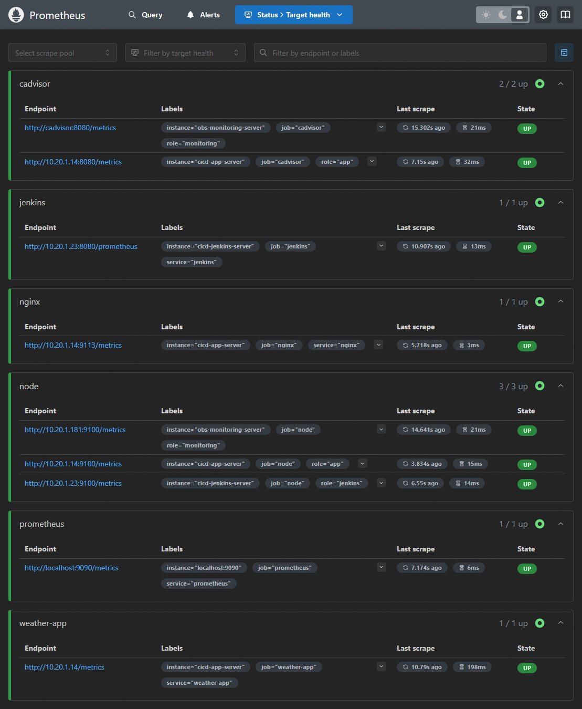

All nine targets UP across six jobs. This is the single best proof that the
scrape path works end to end — security groups, exporters, and the app's own
`/metrics` endpoint all have to be correct for this page to look like this.

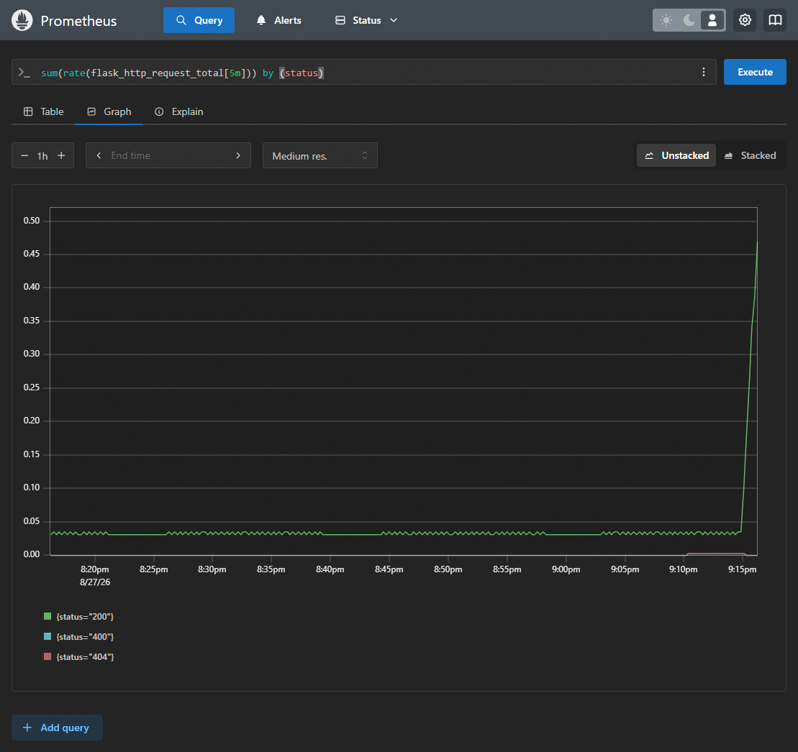

A PromQL query graphing request rate by HTTP status. The visible 200, 400 and
404 series confirm that application metrics aren't just scraped but queryable.

### 2. Dashboards visualize them

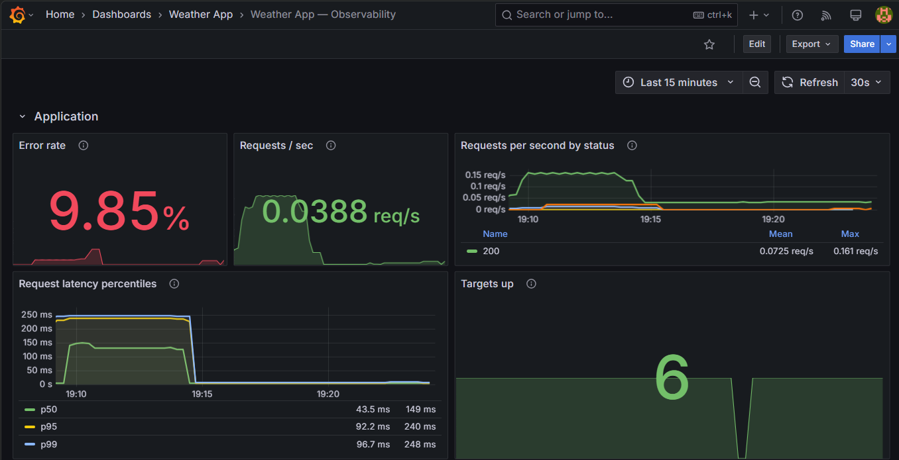

The provisioned dashboard's overview row: throughput, latency and error rate —
the three signals the project requires. Loaded from JSON in this repo rather
than saved in the Grafana UI, so it survives a container rebuild.

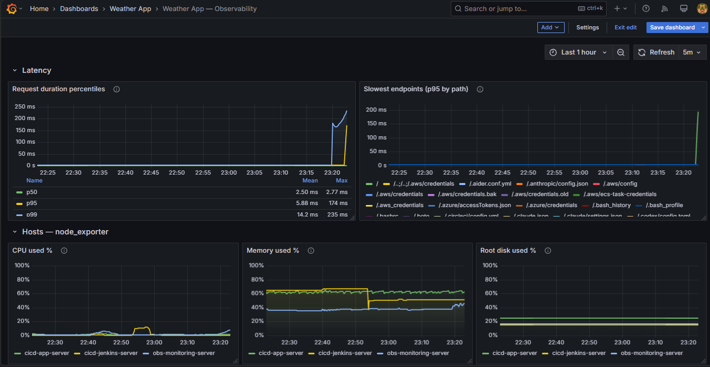

node_exporter and cAdvisor panels underneath the application row —
infrastructure health alongside application health, on the same dashboard.

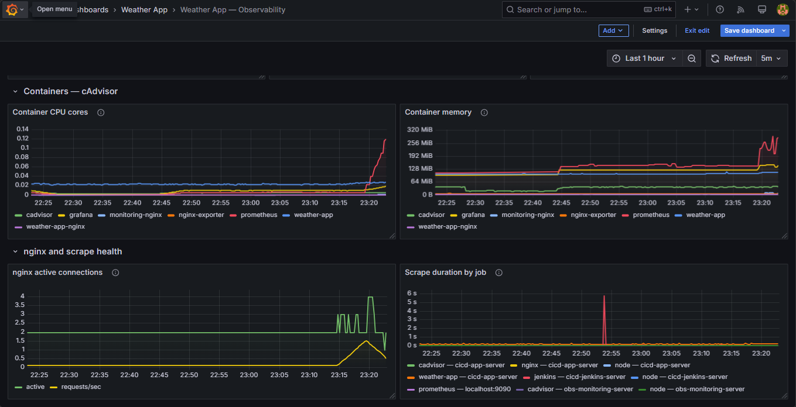

A per-target scrape health panel, so a broken exporter shows up in Grafana and
not just in Prometheus's own `/targets` page.

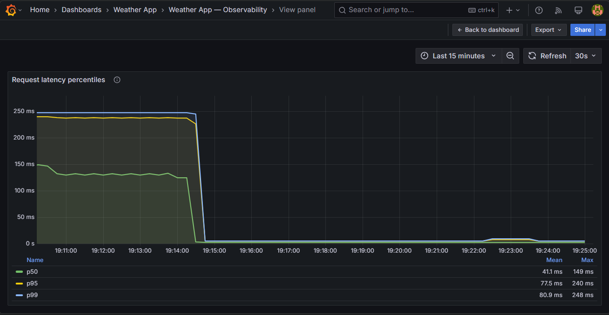

p50/p95/p99 latency broken down by request path. Several of the paths visible
here were never defined by the weather app — `/.aws/credentials`,
`/.bash_history`, `/.env` and similar. That is automated internet
reconnaissance probing a publicly reachable host for leaked secrets. All of it
returned 404. This traffic was not staged; it is what any public host receives
within hours, and it is the clearest practical argument for why the security
half of this project exists.

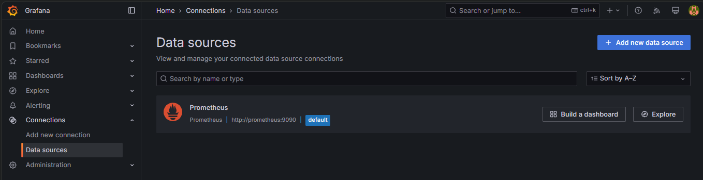

Grafana's Prometheus data source, provisioned rather than clicked in.

### 3. Alert rules evaluate them

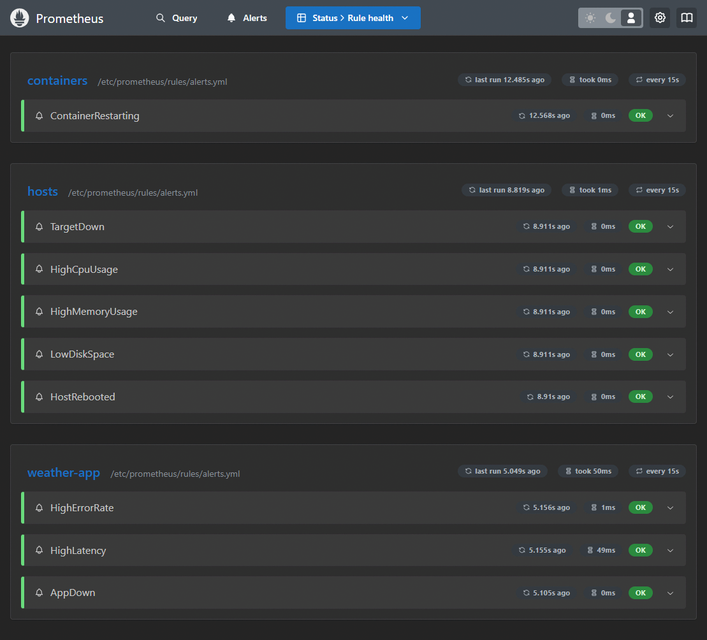

All nine rules loaded, including the one the project requires,
`HighErrorRate` (5xx above 5% of traffic, sustained 2 minutes).

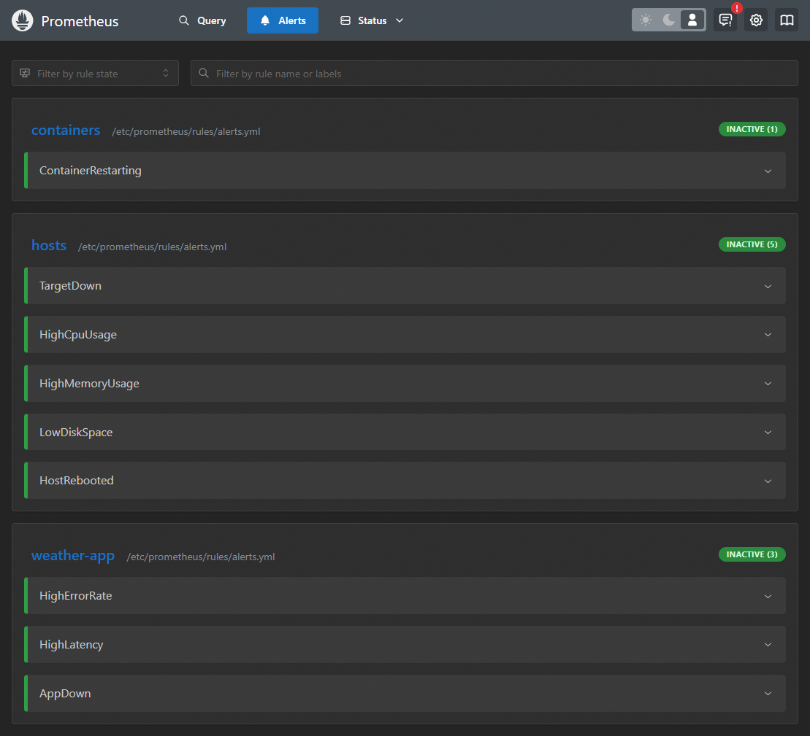

The alert groups registered in Prometheus. Prometheus decides *when* an alert
fires; Alertmanager decides *who* is told and *how*.

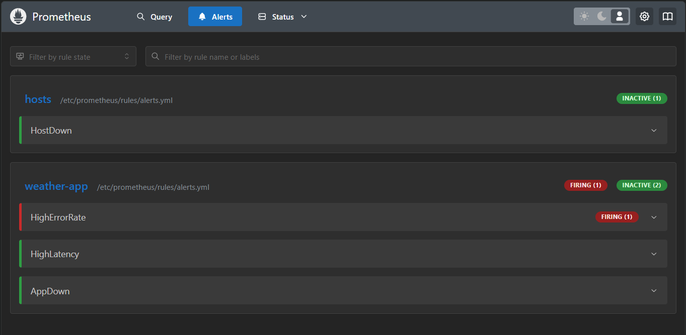

`TargetDown` actually reaching `FIRING (1)` after one of the exporters stopped
responding — proof the evaluation path works end to end, not just that the
rules parse. `HighErrorRate` runs through the same mechanism with a different
expression.

### 4. ...and notify Discord

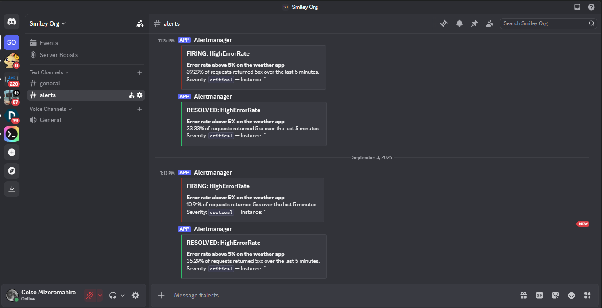

Alerts arriving in the `#alerts` Discord channel with severity and instance labels intact, and the matching RESOLVED notification once the service recovered. This closes the chain: rule evaluated in Prometheus, grouped and routed by Alertmanager, delivered to a human, and cleared automatically when the condition ended.

### 5. Logs

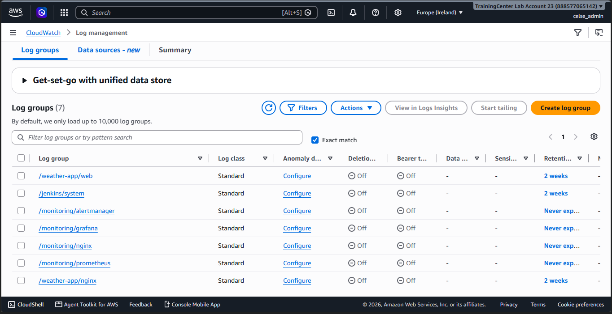

Seven log groups, each with an explicit 14-day retention policy declared in
Terraform — not auto-created by the Docker driver, which would keep (and bill
for) the data forever.

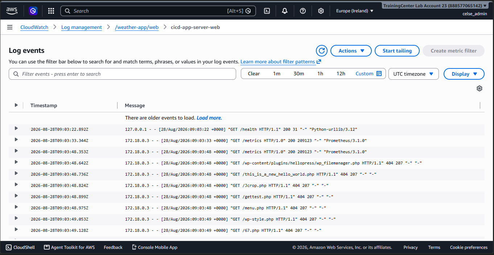

Real application request logs arriving in `/weather-app/web`.

### 6. Audit and threat detection

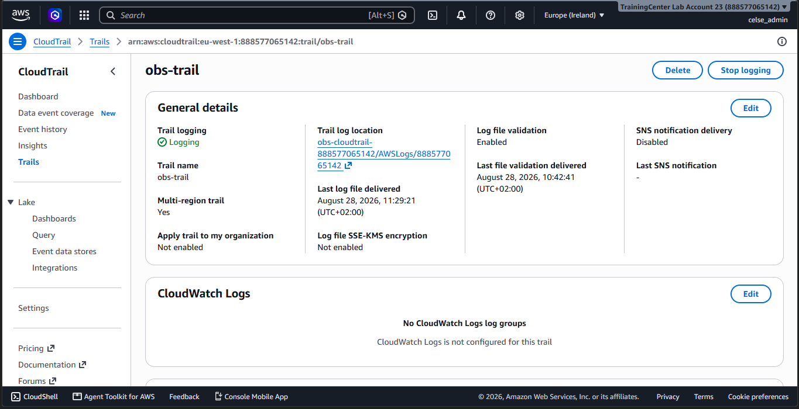

The multi-region trail, with log file validation enabled.

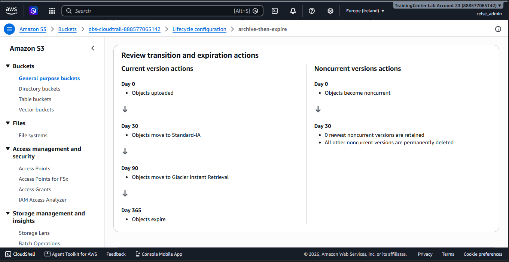

The trail's destination bucket: encrypted, versioned, public access blocked,
and a lifecycle policy moving objects to Infrequent Access at 30 days, Glacier
IR at 90, and expiring them at 365.

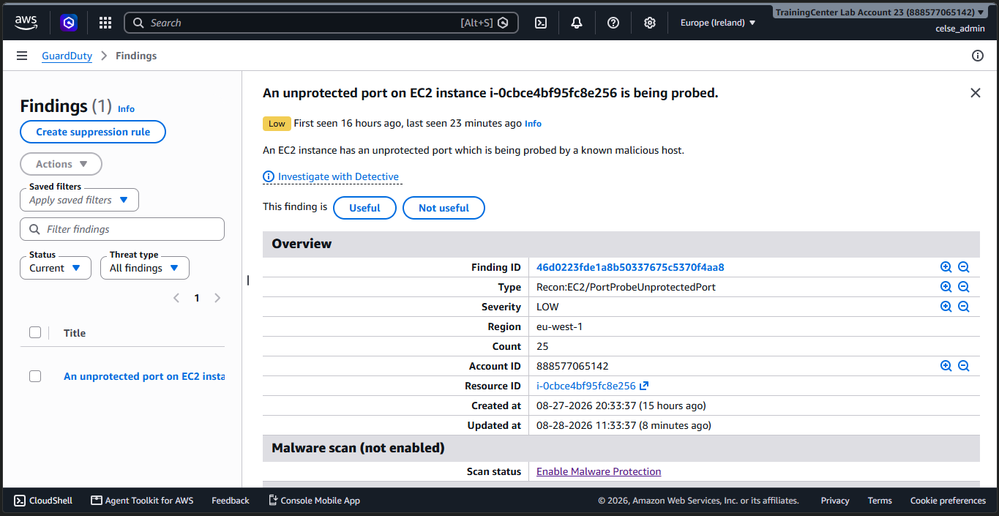

GuardDuty enabled, with sample findings generated deliberately via
`aws guardduty create-sample-findings`. These are labelled `[SAMPLE]` — the
account was not actually attacked. They exist to exercise the detection and
display path end to end without waiting for a real incident.

---

## Repository layout

```
monitoring-and-security-lab/
├── terraform/
│   ├── monitoring.tf            # monitoring EC2 instance + security group
│   ├── iam.tf                   # instance profile for CloudWatch access
│   ├── cloudtrail.tf            # multi-region trail + S3 bucket
│   ├── guardduty.tf             # detector
│   ├── cloudwatch.tf            # log groups, 14-day retention
│   ├── data.tf                  # looks up the existing VPC/subnets by tag
│   ├── outputs.tf
│   └── terraform.tfvars         # gitignored — your admin CIDR
├── ansible/
│   ├── site.yml                 # entrypoint: 3 plays
│   ├── inventory.aws_ec2.yml    # EC2 dynamic inventory, grouped by Role tag
│   ├── group_vars/
│   │   └── all/
│   │       ├── main.yml         # committed defaults (CHANGE-ME placeholder)
│   │       └── secrets.yml      # gitignored — Discord webhook
│   └── roles/
│       ├── docker/
│       ├── node_exporter/       # installed on all 3 hosts
│       ├── app_exporters/       # cAdvisor + nginx-exporter on the app server
│       └── monitoring/          # Prometheus, Grafana, Alertmanager, cAdvisor
├── monitoring/                  # source of truth — Ansible copies this, nothing is hand-configured
│   ├── docker-compose.yml.j2
│   ├── prometheus/
│   │   ├── prometheus.yml
│   │   └── rules/alerts.yml
│   ├── alertmanager/
│   │   └── alertmanager.yml.j2
│   ├── grafana/provisioning/
│   │   ├── datasources/prometheus.yml
│   │   └── dashboards/
│   │       ├── dashboards.yml
│   │       └── weather-app-observability.json
│   └── nginx/monitoring.conf.j2
├── screenshots/                 # evidence referenced above
├── docs/
│   └── REPORT.md
├── monitoring-lab-architecture.png
└── README.md
```

Everything under `monitoring/` is the source of truth. Ansible copies it to the
host; nothing is configured by hand.

---

## Design decisions

**Two proxied ports rather than URL sub-paths.** Prometheus and Grafana both
need extra configuration to serve under a prefix, and both fail in confusing
ways when it is slightly wrong. Serving each at the root of its own port avoids
the problem entirely.

**`/metrics` restricted to the VPC, not the internet.** The app's nginx allows
`/metrics` only from the VPC CIDR, so Prometheus can scrape it and nobody else
can. A side effect worth knowing: curling it *from the app server itself*
returns **403**, because Docker's NAT rewrites host-local traffic to a bridge
address that isn't in the allowed range. That is the allow-list working, not a
fault — test from the monitoring host instead.

**IAM instance profile, not access keys.** Both hosts assume a role for
CloudWatch access. No long-lived credentials exist anywhere in this repo or on
any instance.

**Directory bind mounts, not single files.** A single-file bind mount binds that
file's *inode*. Ansible writes a temp file and renames it into place, creating a
new inode — so the container keeps serving the old content and a reload re-reads
a file that no longer exists. Mounting the directory makes Docker resolve the
path on each open.

**File modes account for container UIDs.** Containers share the host's numeric
UID namespace but not its user names. nginx workers run as UID 101 and
Alertmanager as UID 65534, so a config file at mode 0640 owned by `ec2-user`
is unreadable to them — nginx answers 500 and Alertmanager crash-loops. Config
files that containers read are mode 0644.

**Dashboards provisioned from JSON.** Saving a dashboard in the Grafana UI
creates drift that disappears the next time the container is recreated. The JSON
in this repo is authoritative.

**Targets generated from inventory.** Addresses live in `targets/*.json`,
written by Ansible from the EC2 dynamic inventory and re-read by Prometheus
without a restart. Rebuild the infrastructure and one playbook run points it at
the new IPs.

---

## Teardown

```bash
cd terraform
terraform destroy
```

The CloudTrail bucket has versioning enabled, so empty it first — otherwise the
destroy fails on a non-empty bucket:

```bash
aws s3 rm s3://$(terraform output -raw cloudtrail_bucket) --recursive
```

Verify afterwards that the GuardDuty detector, the trail, the bucket and the
CloudWatch log groups are all gone.